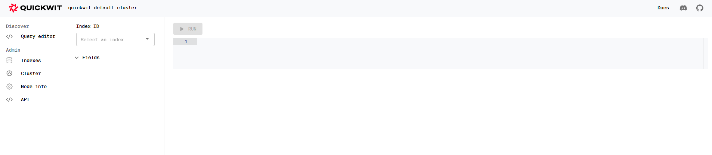

# Quickwit CI/CD pipeline

Deploy Quickwit server with CI/CD on Elestio

 
 

# Once deployed ...

You can open Quickwit UI here:

    URL: https://[CI_CD_DOMAIN]
    login: "root"
    password: "[ADMIN_PASSWORD]"

# Quickwit with curl commands

This guide provides instructions on how to utilize Quickwit with curl commands for various operations like creating an index, adding documents, querying, and performing clean-up tasks.

## Create your first index

To start using Quickwit, you need to create an index configured with a YAML config file. This configuration file allows you to specify how your input documents should be mapped to index fields and whether these fields should be stored and indexed. Here's how you can create an index configured to receive Stack Overflow posts (questions and answers):

    curl -o stackoverflow-index-config.yaml https://raw.githubusercontent.com/quickwit-oss/quickwit/main/config/tutorials/stackoverflow/index-config.yaml

Now, create the index with the following command:

    curl -u root:[ADMIN_PASSWORD] -XPOST https://[CI_CD_DOMAIN]/api/v1/indexes --header "content-type: application/yaml" --data-binary @./stackoverflow-index-config.yaml

## Adding documents

After creating the index, you can add documents to it. Let's download a bunch of Stack Overflow posts (10,000) in ndjson format and index them:

    curl -O https://quickwit-datasets-public.s3.amazonaws.com/stackoverflow.posts.transformed-10000.json

Then, use the following command to index the downloaded documents:

    curl -u root:[ADMIN_PASSWORD] -XPOST "https://[CI_CD_DOMAIN]/api/v1/stackoverflow/ingest?commit=force" --data-binary @stackoverflow.posts.transformed-10000.json

## Queries

You can perform queries on the indexed data. Here are a few examples:

### Query on the field "title"

    curl -u root:[ADMIN_PASSWORD] "https://[CI_CD_DOMAIN]/api/v1/stackoverflow/search?query=title:search+AND+engine"

### JSON query example

    curl -u root:[ADMIN_PASSWORD] -XPOST "https://[CI_CD_DOMAIN]/api/v1/stackoverflow/search" -H 'Content-Type: application/json' -d '{
        "query": "title:search AND engine"
    }'

### JSON query with aggregation

    curl -u root:[ADMIN_PASSWORD] -XPOST "https://[CI_CD_DOMAIN]/api/v1/stackoverflow/search" -H 'Content-Type: application/json' -d '{
    "query": "type:question",
    "max_hits": 0,
    "aggs": {
        "foo": {
            "terms":{
                "field":"tags",
                "size": 10
            }
        }
    }

}'

## Clean-up

To perform clean-up tasks like deleting the index, use the following command:

    curl root:[ADMIN_PASSWORD] -XDELETE https://[CI_CD_DOMAIN]/api/v1/indexes/stackoverflow

# Documentation

For comprehensive documentation and getting started guides, please visit the Quickwit documentation page: <a target="_blank" href="https://quickwit.io/docs/get-started/quickstart">Quickwit Documentation</a>
